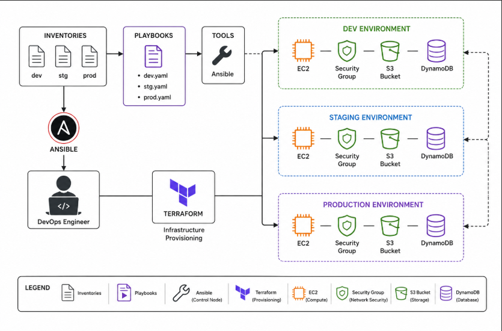

# Multi-Environment Infrastructure Automation using Terraform & Ansible

## Overview

This project automates AWS infrastructure provisioning and server configuration across Development, Staging, and Production environments using Terraform and Ansible.

Terraform provisions the infrastructure while Ansible configures and manages the servers through environment-specific inventories and playbooks.

---

## Architecture Diagram

<p align="center">
  
</p>

---

## Architecture Flow

```text
DevOps Engineer
       │
       ▼
Terraform
       │
       ├──────────► DEV Environment
       │               ├── EC2
       │               ├── Security Group
       │               ├── S3 Bucket
       │               └── DynamoDB
       │
       ├──────────► STG Environment
       │               ├── EC2
       │               ├── Security Group
       │               ├── S3 Bucket
       │               └── DynamoDB
       │
       └──────────► PRD Environment
                       ├── EC2
                       ├── Security Group
                       ├── S3 Bucket
                       └── DynamoDB

Ansible
   │
   ├── Inventory (dev)
   ├── Inventory (stg)
   ├── Inventory (prd)
   │
   └── Playbooks configure all provisioned servers
```

---

## Key Features

* Multi-Environment Infrastructure (Dev, Stg, Prd)
* Infrastructure as Code using Terraform
* Configuration Management using Ansible
* Reusable Terraform Modules
* Environment-specific Inventories
* Automated Server Configuration
* Scalable and Consistent Deployments
* Centralized Management

## Technologies Used

* AWS
* Terraform
* Ansible
* Ubuntu Linux
* Git
* GitHub

## Project Structure

```text
terraform/
│
├── Infrastructure/
│   ├── ec2.tf
│   ├── sg.tf
│   ├── s3.tf
│   ├── dynamodb.tf
│   ├── variables.tf
│   └── outputs.tf
│
├── main.tf
├── master.tf
└── provider.tf

ansible/
│
├── Inventories/
│   ├── dev_env
│   ├── stg_env
│   └── prd_env
│
└── Playbook/
    ├── dev.yaml
    ├── stg.yaml
    └── prd.yaml

images/
└── architecture.png
```

## Deployment

### Provision Infrastructure

```bash
terraform init
terraform plan
terraform apply
```

### Configure Servers

```bash
ansible-playbook -i Inventories/dev_env Playbook/dev.yaml

ansible-playbook -i Inventories/stg_env Playbook/stg.yaml

ansible-playbook -i Inventories/prd_env Playbook/prd.yaml
```

## Learning Outcomes

* Terraform Modules
* AWS Infrastructure Provisioning
* Ansible Inventories & Playbooks
* Infrastructure Automation
* Configuration Management
* Multi-Environment Deployment
* DevOps Best Practices

```
```
